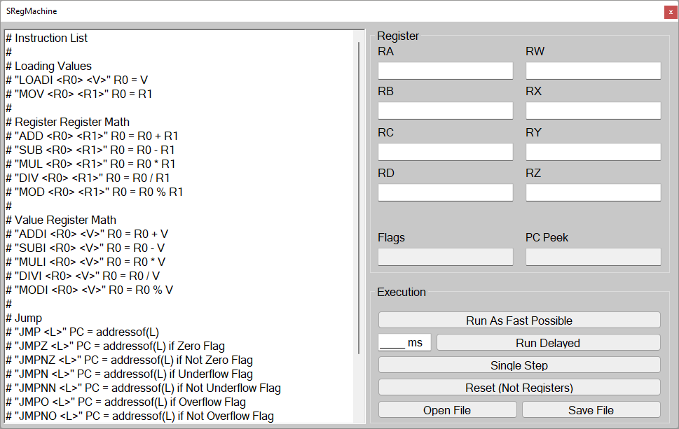

# SRegMachine
Simple register machine for learning assembler (Windows .NET 4.8)




## Instruction List

#### Loading and moving Values

```assembly
LOADI <reg0> $value # Load the value '$value' into register 'reg0'
```

```assembly
MOV <reg0> <reg1> # Copyies the value from 'reg1' into 'reg0'
```

#### Math with registers

Every math instructions will set flags (zero, neg, ov)

```assembly
ADD <reg0> <reg1> # 'reg0' = 'reg0' + 'reg1'
```

```assembly
SUB <reg0> <reg1> # 'reg0' = 'reg0' - 'reg1'
```

```assembly
MUL <reg0> <reg1> # 'reg0' = 'reg0' * 'reg1'
```

```assembly
DIV <reg0> <reg1> # 'reg0' = 'reg0' / 'reg1'
```

```assembly
MOD <reg0> <reg1> # 'reg0' = 'reg0' % 'reg1'
```

#### Math with integers

Every math instructions will set flags (zero, neg, ov)

```assembly
ADD <reg0> $value # 'reg0' = 'reg0' + 'value'
```

```assembly
SUB <reg0> $value # 'reg0' = 'reg0' - 'value'
```

```assembly
MUL <reg0> $value # 'reg0' = 'reg0' * 'value'
```

```assembly
DIV <reg0> $value # 'reg0' = 'reg0' / 'value'
```

```assembly
MOD <reg0> $value # 'reg0' = 'reg0' % 'value'
```

#### Jumping

Labels are defined by typing a ':' (Collum)

```assembly
JMP $label_name # Will jumpt to 'label_name'
```

```assembly
JMPZ $label_name # Will jumpt to 'label_name' when zero flag is set
```

```assembly
JMPNZ $label_name # Will jumpt to 'label_name' when zero flag is NOT set
```

```assembly
JMPN $label_name # Will jumpt to 'label_name' when negative flag is set
```

```assembly
JMPNN $label_name # Will jumpt to 'label_name' when negative flag is NOT set
```

```assembly
JMPO $label_name # Will jumpt to 'label_name' when overflow flag is set
```

```assembly
JMPNO $label_name # Will jumpt to 'label_name' when overflow flag is NOT set
```

#### Flow Control

```assembly
HOLD # Will hold the execution
```

```assembly
RST # Will reset to the first instuction (continues execution)
```

```assembly
EOF # End of file (RST + HOLD)
```

